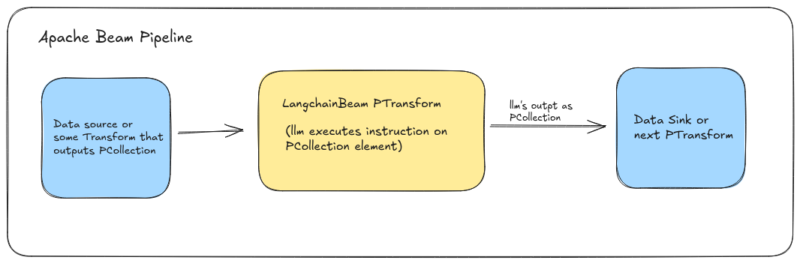

# Introduction

Integrates **LLMs as PTransform** into Apache Beam pipeline using langchain


## What is Langchain-Beam?

Langchain-Beam integrates large language models (LLMs) as PTransform in Apache Beam pipelines, leveraging the capabilities of LLMs for data processing and creating Retrieval-Augmented Generation (RAG) based pipelines in Beam.

Apache Beam is a programming model for creating batch and streaming-based data processing pipelines. It's an abstraction that provides a way to create data processing logic as Transforms, each transform is like a stage in the pipeline, when the data flows through the transform the data transformation logic is applied on it and the transformed data is emitted back in pipeline and would reach
the next transform or stage...



Langchain-Beam library provide transfoms to integrate LLMs into beam pipelines to combine the apache beam's abstraction with the capabilities of Large Language Models, such as generation, completion, classification, and reasoning to process the data within apache beam pipeline.
This integration bridges the power of modern language models with distributed data processing and ETL pipelines, creating a new paradigm for building intelligent data pipelines.

## Benefits

- **Efficient LLM Utilization**: Take advantage of LLMs' advanced capabilities without managing LLM integration in pipelines.
- **Seamless Apache Beam Integration**: Integrates directly with Beam pipelines, enabling parallel data processing and scalability.
- **Customizable and Extensible**: Customize LLM usage and integrate with various Beam transforms to suit specific use cases.

## Key Features

- **LLM Transform** : Integrates Large language Models from providers like OpenAI, Anthropic into Beam pipeline
- **Embedding Model Transform**: Integrates Embedding models to generate text embeddings in Beam pipeline.

## Getting started

To start using Langchain-Beam, add the latest version of library as depedency into your java project and ensure you have the required Apache Beam dependencies in your project.

with Maven project in `pom.xml`

```xml
<dependency>
    <groupId>io.github.ganeshsivakumar</groupId>
    <artifactId>langchain-beam</artifactId>
    <version>0.3.0</version>
</dependency>
```

with Gradel in `build.gradel`

```
implementation group: 'io.github.ganeshsivakumar', name: 'langchain-beam', version: '0.2.0'
```

### Steps to Use LLM Transform

LLM Transform can be used in a pipeline to integrate models using 3 simple steps.

**1. Sepcify models options :**
Define the model provider and the model that you want to use in pipeline and its settings like temperature, max tokens etc..

```java
// Create model options with the model and its parameters
OpenAiModelOptions modelOptions = OpenAiModelOptions.builder()
        .modelName("gpt-4o-mini")
        .apiKey(OPENAI_API_KEY)
        .build();

```

**2. Define the Instruction Prompt :**
Create an instruction prompt that will guide the model on how to process each input element.

```java

String prompt = "Classify the following product review as either Positive or Negative. Consider the sentiment conveyed in the review, focusing on the overall tone and the presence of key positive or negative phrases"
```

**3. Use the Transform in pipeline :**
Create a model handler object and pass the handler to the transform in pipeline

```java
// Initialize the LangchainModelHandler with model options and prompt
LangchainModelHandler handler = new LangchainModelHandler(modelOptions, prompt);

//create the apache beam pipeline
Pipeline p = Pipeline.create();

// Apply transformations in the pipeline

//pipeline stage 1. load data
p.apply(TextIO.read().from("/home/ganesh/Downloads/product_reviews.csv"))
         // Stage 2. Run thehandler using LangchainBeam LLM transform
        .apply(LangchainBeam.run(handler))
        // Stage 3. print model output
        .apply(ParDo.of(new DoFn<String, Void>() {
            @ProcessElement
            public void processElement(@Element LangchainBeamOutput out) {
                System.out.println("Model Output: " + out.getOutput());  // Print model output
            }
        }));

p.run();  // Execute the pipeline
```

Check out how-to section for detailed guide on how to create beam pipeline with LLM transform and run the pipeline locally.
