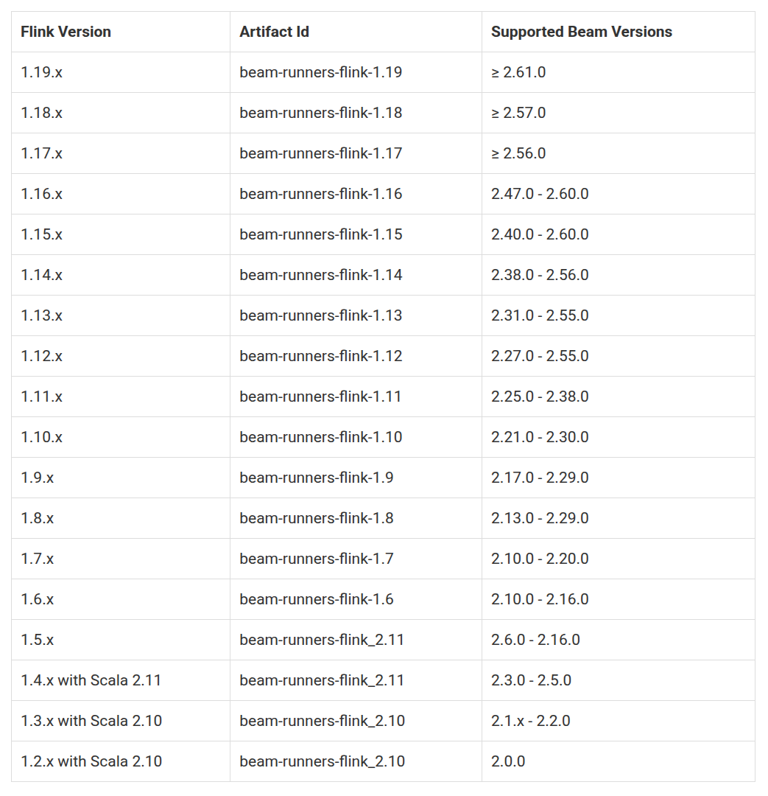
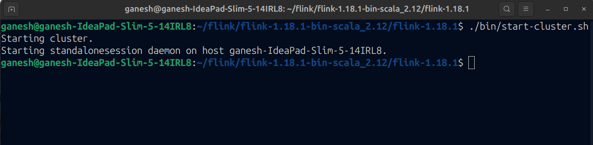
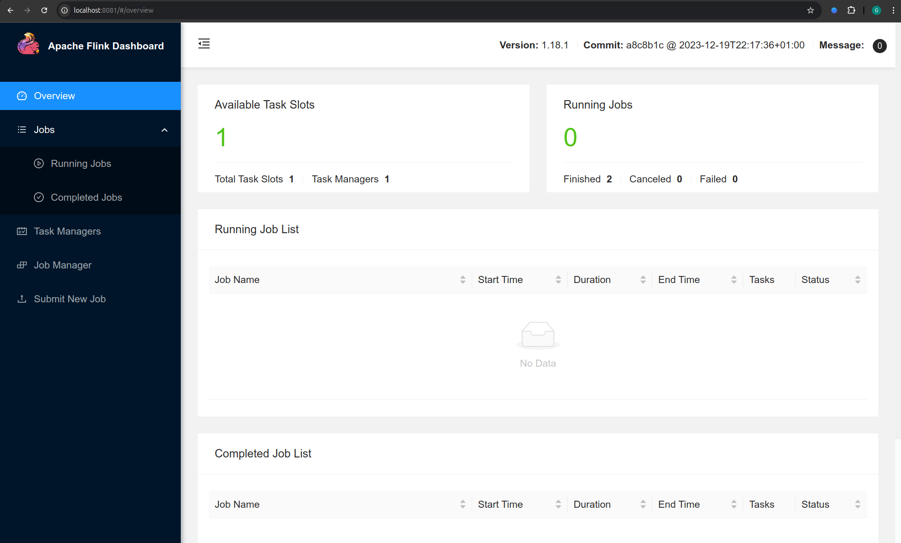
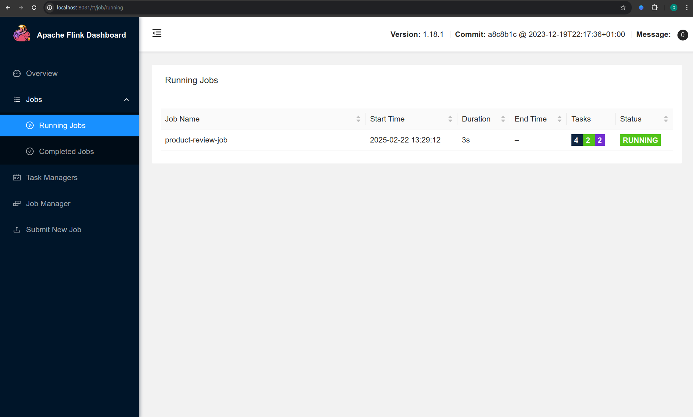
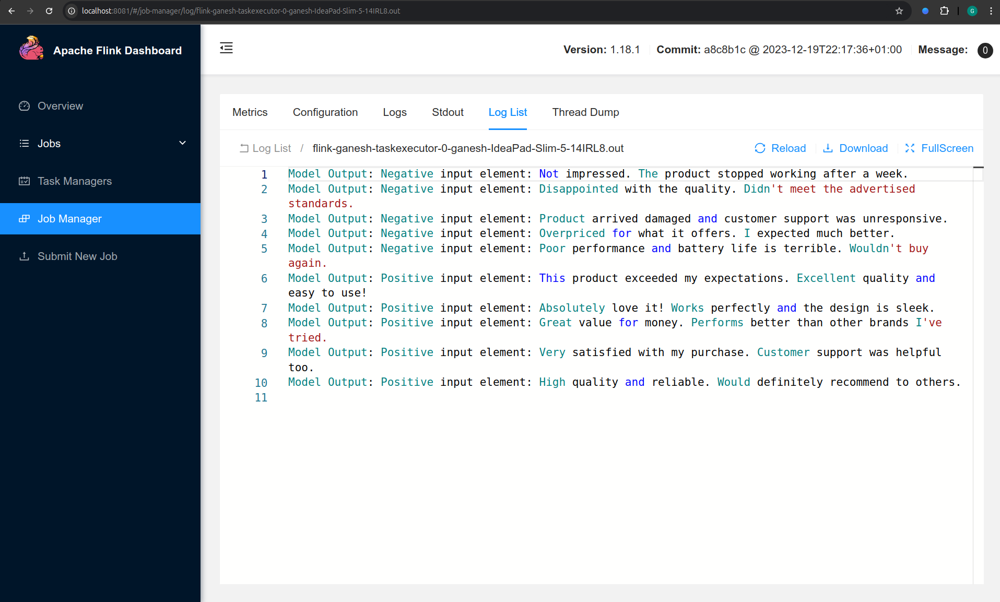

# Run sentiment analysis pipeline using Apache Flink runner

This notebook share how to perform sentiment analysis in beam pipeline using [LLM transform](../../guide/langchain-Beam-transforms#llm-transform) and run it using Apache Flink runner.

Apache Flink is a powerful, distributed stream and batch data processing engine known for its scalability, fault tolerance, and stateful processing capabilities. In the context of Apache Beam, Flink serves as a robust runner that can efficiently execute complex pipelines, including those involving large language models (LLMs).

By leveraging the Flink runner, your Beam pipeline can handle continuous data streams while integrating seamlessly with Langchain-Beam’s LLM transforms for NLP tasks like sentiment analysis.

The pipeline

- loads the csv file that contains reviews and feedback of a product
- uses LLM transform to categorize reviews and get sentiment
- print the model output

## **1. Create the project 📦**

Create a java maven project and import necessary dependencies in your `pom.xml`

```xml
<!-- Add Flink runner dependency and make sure that the runner
dependency version is compatible with `beam-sdks-java-core` version -->
        <dependency>
            <groupId>org.apache.beam</groupId>
            <artifactId>beam-runners-flink-1.18</artifactId>
            <version>2.61.0</version>
        </dependency>
        <!-- Use latest version of Langchain-Beam -->
        <dependency>
            <groupId>io.github.ganeshsivakumar</groupId>
            <artifactId>langchain-beam</artifactId>
            <version>0.3.0</version>
        </dependency>
        <!-- Apache Beam -->
        <dependency>
            <groupId>org.apache.beam</groupId>
            <artifactId>beam-sdks-java-core</artifactId>
            <version>2.61.0</version>
        </dependency>
```

The Final JAR file of the project should be a [Fat Jar](https://stackoverflow.com/questions/19150811/what-is-a-fat-jar), i.e, the Jar file of the project should include all the dependencies that the pipeline is using, May be that's why its called "Fat" Jar 🐷

```xml
<!-- Use Maven Shade Plugin to create Fat Jar -->
    <build>
        <plugins>
            <!-- Maven Shade Plugin -->
            <plugin>
                <groupId>org.apache.maven.plugins</groupId>
                <artifactId>maven-shade-plugin</artifactId>
                <version>3.2.1</version>
                <executions>
                    <execution>
                        <phase>package</phase>
                        <goals>
                            <goal>shade</goal>
                        </goals>
                        <configuration>
                            <createDependencyReducedPom>false</createDependencyReducedPom>
                            <artifactSet>
                                <includes>
                                    <!-- Include everything -->
                                    <include>*:*</include>
                                </includes>
                            </artifactSet>
                            <filters>
                                <filter>
                                    <artifact>*:*</artifact>
                                    <excludes>
                                        <!-- Exclude signature files -->
                                        <exclude>META-INF/*.SF</exclude>
                                        <exclude>META-INF/*.RSA</exclude>
                                        <exclude>META-INF/*.DSA</exclude>
                                    </excludes>
                                </filter>
                            </filters>
                            <transformers>
                                <!-- Merge META-INF/services files -->
                                <transformer implementation="org.apache.maven.plugins.shade.resource.ServicesResourceTransformer" />
                            </transformers>
                            <shadedArtifactAttached>false</shadedArtifactAttached>
                            <minimizeJar>false</minimizeJar>
                        </configuration>
                    </execution>
                </executions>
            </plugin>
    </build>
```

## **2. Create pipeline 🛠️**

Now, let's define the Apache Beam pipeline. We'll start by importing the required modules and setting up the necessary components.

### Define the Instruction Prompt

The `instruction prompt` guides the model on how to process each input element in the pipeline. In this case, our goal is to analyze the sentiment of product reviews. We define the prompt as:

```java
String prompt = "Categorize the product review as Positive or Negative.";
```

During pipeline execution, the model will use this prompt to process input elements, which consist of a list of product reviews.

### Configure the Model and Options

Next, we need to define the model and its options. We'll use OpenAI’s **GPT-4o-mini** to process the reviews. Langchain-Beam provides the `OpenAiModelOptions` class, which allows us to specify:

- The model name
- The API key
- Other parameters such as **temperature** for response variability

```java
String apiKey = System.getenv("OPENAI_API_KEY");

        // Create model options with the model and its parameters
        OpenAiModelOptions modelOptions = OpenAiModelOptions.builder()
                .modelName("gpt-4o-mini")
                .apiKey(apiKey)
                .build();
```

### Store Prompt and Model Options

We encapsulate both the prompt and model options inside a `LangchainModelHandler` object. This handler manages how the model is invoked within the pipeline.

```java
// create LangchainModelHandler to pass it to LangchainBeam transform
LangchainModelHandler handler = new LangchainModelHandler(modelOptions, prompt);
```

### Build the Beam Pipeline

Now, we construct the Beam pipeline, Since we are using Apache Flink runner, we'll set the flink pipeline specfic
options and the create the beam pipeline that will:

- **Load** the product reviews data from a local file
- **Apply** the LLM transform to analyze sentiment
- **Print** the model's output

```java
// create flink pipeline specfic options
        FlinkPipelineOptions options = PipelineOptionsFactory.as(FlinkPipelineOptions.class);
        options.setJobName("product-review-job");
        options.setRunner(FlinkRunner.class);
        options.setParallelism(2); // parallel execution

        // create beam pipeline
        Pipeline p = Pipeline.create(options);

        p.apply(TextIO.read().from("/home/ganesh/Downloads/product_reviews.csv"))// load data
                .apply(LangchainBeam.run(handler)) // apply the LangchainBeam transform.
                .apply(ParDo.of(new DoFn<LangchainBeamOutput, Void>() {

                    @ProcessElement
                    public void processElement(@Element LangchainBeamOutput out) {
                        // print model output
                        System.out
                                .println("Model Output: " + out.getOutput() + " input element: "
                                        + out.getInputElement());
                    }
                }));

        // run pipeline
        p.run();
```

**Full Code Reference:**
For the complete implementation with imported modules, check out the GitHub repository:

[🔗 Langchain-Beam Flink Example](https://github.com/Ganeshsivakumar/langchain-beam/blob/main/example/langchain-beam-example/src/main/java/com/langchainbeam/example/ApacheFlinkExample.java)

## **3. Run Pipeline on Apache Flink Cluster 🚀**

Now that we have created the pipeline and its transform components, we can run it as a job in Apache Flink. We’ll start by setting up a local Flink cluster.

### Set up Apache Flink

To execute the pipeline using the Flink Runner, you need to set up an Apache Flink cluster. Follow the Flink [Setup Quickstart](https://nightlies.apache.org/flink/flink-docs-release-1.20/docs/deployment/resource-providers/standalone/overview/#preparation) to install and configure Flink.

#### Choose the Compatible Flink Version

Ensure that you install an Apache Flink version compatible with Apache Beam and the Flink Runner. For this example, we are using:

- **Apache Beam**: `artifactId: beam-sdks-java-core, version: 2.61.0`
- **Flink Runner**: `artifactId: beam-runners-flink-1.18, version: 2.61.0`
- **Apache Flink**: `1.18.1`

Refer to the compatibility table from Apache Beam for selecting the correct Flink version:



To download the appropriate Flink version, visit the [Flink downloads page](https://flink.apache.org/downloads/).

### Start the Flink Cluster

Once you have downloaded and extracted the correct Flink version, start a **standalone cluster in Session Mode** as described in the [Flink documentation](https://nightlies.apache.org/flink/flink-docs-release-1.20/docs/deployment/resource-providers/standalone/overview/#starting-a-standalone-cluster-session-mode).



After starting the cluster, verify that the Flink Web UI is running by navigating to [http://localhost:8081/](http://localhost:8081). If the cluster is running successfully, you should see the Flink dashboard:



### Submit Job

Now that we have set up the Flink cluster and configured our Apache Beam pipeline, we can submit the job for execution.

#### Build the Pipeline JAR

Before submitting the job, we need to package our Apache Beam pipeline as a JAR file. Navigate to your project directory and run:

```sh
mvn clean package
```

This will generate a JAR file inside the `target/` directory. Make sure to locate this JAR, as it will be used in the next step

#### Submit the Job to the Flink Cluster

To submit the pipeline job, use the following command:

```sh
./bin/flink run -c com.example.Main /home/ganesh/Dev/beampipeline/flinkrun/lbflink/target/lbflink-1.0-SNAPSHOT.jar
```

> **Note:** Update your Main class name and jar file path in command.

### Job Output

Once the job is submitted, head over to the Flink dashboard web UI to monitor execution
and you should see your job listed under **Running Jobs**



Click on the Job ID in the Flink dashboard to access detailed execution metrics, logs, and operator statistics.

Once the pipeline completes execution, review the logs to see the model’s output printed by the job.



Congratulations! 🎉 You’ve successfully deployed and executed
a LangChain-Beam pipeline on Apache Flink.

Now, feel free to experiment with different prompts, models, or data sources and different use cases to further enhance your pipeline. Happy coding! 💡
